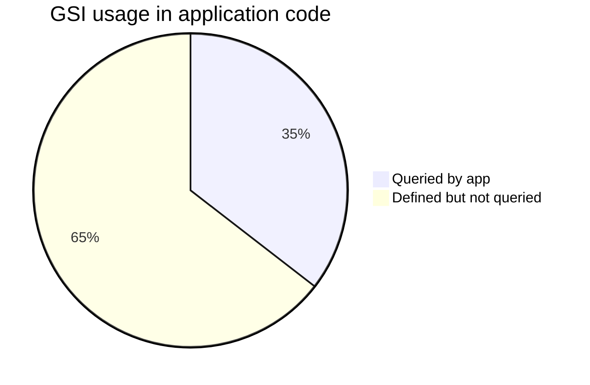

# Indexes Reference

Global Secondary Indexes (GSI) and Local Secondary Indexes (LSI) across all DynamoDB tables.

**Projection:** All GSIs in this codebase use `ProjectionType: ALL` unless noted.

**See also:** [ACCESS_PATTERNS.md](./ACCESS_PATTERNS.md) · [TABLE_REFERENCE.md](./TABLE_REFERENCE.md)

---

## LSI summary

**None.** No table defines a Local Secondary Index.

---

## GSI usage overview



| Status | Count | Meaning |
|---|---|---|
| **Active** | 11 index usages | Referenced in `QueryCommand` with `IndexName` |
| **Inactive** | 20 index definitions | Created in DDL but list/filter logic uses `Scan` instead |
| **Unused definition** | 1 | `Admin.PhoneIndex` — no code reference |

---

## Active indexes (queried in code)

| Table | Index | PK | SK | Used by |
|---|---|---|---|---|
| `User` | `EmailIndex` | `email` | — | `getUserByEmail` |
| `User` | `PhoneKeyIndex` | `phoneKey` | — | `getUserByPhone` |
| `Admin` | `EmailIndex` | `email` | — | `getAdminByEmail` |
| `WellnessCoach` | `EmailIndex` | `email` | — | `getWellnessCoachByEmail` |
| `WellnessCoach` | `PhoneKeyIndex` | `phoneKey` | — | `getWellnessCoachByPhone` |
| `AssistantWellnessCoach` | `EmailIndex` | `email` | — | `getAssistantByEmail` |
| `AssistantWellnessCoach` | `PhoneKeyIndex` | `phoneKey` | — | `getAssistantByPhone` |
| `AssistantWellnessCoach` | `WellnessCoachIndex` | `wellnessCoachId` | `createdAt` | `listAssistantsByWellnessCoachId`, `countAssistantsByWellnessCoachId` |
| `StaticPage` | `SlugIndex` | `slug` | — | `getPageBySlug` |
| `Coupon` | `CouponCodeIndex` | `couponCode` | — | `getCouponByCode` |
| `Specialization` | `TitleKeyIndex` | `titleKey` | — | `getSpecializationByTitleKey` |

### Base-table Query (not GSI)

| Table | Pattern | Keys |
|---|---|---|
| `Admin` | `getAdminKeyById` | Query base table `id = :id` (composite PK requires resolving `createdAt`) |

---

## Inactive indexes (defined in DDL, not queried)

These indexes support access patterns that **could** replace current Scan-based listings but are **not used** in `Backend/models/` as of this analysis.

| Table | Index | PK | SK | Intended pattern |
|---|---|---|---|---|
| `User` | `StatusCreatedAtIndex` | `status` | `createdAt` | List users by status, newest first |
| `Admin` | `PhoneIndex` | `phone` | — | Lookup admin by phone (**no code**) |
| `WellnessCoach` | `StatusCreatedAtIndex` | `status` | `createdAt` | List coaches by status |
| `WellnessCoach` | `SpecializationIdIndex` | `specializationId` | `createdAt` | List coaches per specialization |
| `AssistantWellnessCoach` | `StatusCreatedAtIndex` | `status` | `createdAt` | List assistants by status |
| `Faq` | `StatusIndex` | `status` | `createdAt` | List FAQs by status |
| `Coupon` | `StatusIndex` | `status` | `createdAt` | List coupons by status |
| `Notification` | `StatusSentAtIndex` | `status` | `sentAt` | List by status, sorted by sent time |
| `Notification` | `AudienceSentAtIndex` | `audienceType` | `sentAt` | List by audience |
| `StaticPage` | `StatusUpdatedAtIndex` | `status` | `updatedAt` | List pages by status |
| `Transformation` | `StatusCreatedAtIndex` | `status` | `createdAt` | List transformations by status |
| `Transformation` | `UserIdCreatedAtIndex` | `userId` | `createdAt` | List transformations per user |
| `Banner` | `StatusCreatedAtIndex` | `status` | `createdAt` | List banners by status |
| `CelebrationBanners` | `TypeCreatedAtIndex` | `type` | `createdAt` | List by banner type |
| `CelebrationBanners` | `StatusCreatedAtIndex` | `status` | `createdAt` | List by status |
| `HealthConcern` | `StatusCreatedAtIndex` | `status` | `createdAt` | List concerns by status |
| `HealthDisorder` | `StatusCreatedAtIndex` | `status` | `createdAt` | List disorders by status |
| `HealthTool` | `StatusCreatedAtIndex` | `status` | `createdAt` | List tools by status |
| `HealthRecipe` | `StatusCreatedAtIndex` | `status` | `createdAt` | List recipes by status |
| `HealthRecipe` | `HealthConcernCreatedAtIndex` | `healthConcernId` | `createdAt` | List recipes per concern |
| `Yoga` | `StatusCreatedAtIndex` | `status` | `createdAt` | List yoga by status |
| `Specialization` | `StatusCreatedAtIndex` | `status` | `createdAt` | List specializations by status |

---

## Index design conventions

| Convention | Example |
|---|---|
| Status listing | `{ status HASH, createdAt RANGE }` named `StatusCreatedAtIndex` |
| Unique lookup | Single-hash GSI: `EmailIndex`, `PhoneKeyIndex`, `SlugIndex`, `CouponCodeIndex`, `TitleKeyIndex` |
| Parent-child | `WellnessCoachIndex`: `wellnessCoachId` + `createdAt` on assistants |
| Phone normalization | `phoneKey` = `{countryCode}#{phone}` for stable GSI key |

---

## Write amplification note

Every GSI with `ProjectionType: ALL` duplicates the full item on each index. With ~31 GSIs across 21 tables, each `PutItem`/`UpdateItem` may propagate to multiple indexes. Inactive GSIs still incur **storage and write cost** without read benefit.

---

## Recommended Query migrations

Priority replacements for Scan → Query (indexes already exist):

| Model function | Current | Target index |
|---|---|---|
| `listUsers` | Scan | `User.StatusCreatedAtIndex` |
| `listWellnessCoaches` | Scan | `WellnessCoach.StatusCreatedAtIndex` |
| `listHealthRecipes` (with `healthConcernId`) | Scan | `HealthRecipe.HealthConcernCreatedAtIndex` |
| `listTransformations` (with `userId`) | Scan | `Transformation.UserIdCreatedAtIndex` |
| `listNotifications` (with `audienceType`) | Scan | `Notification.AudienceSentAtIndex` |
| `listCelebrationBanners` (with `type`) | Scan | `CelebrationBanners.TypeCreatedAtIndex` |
| All `list*` with `status` only | Scan | Respective `Status*Index` / `StatusCreatedAtIndex` |

Example Query shape for status listing:

```
Query IndexName = StatusCreatedAtIndex
  KeyConditionExpression = #status = :active
  ScanIndexForward = false   // newest first
```

Add `FilterExpression` only for search text (cannot be indexed with `contains` on Scan replacement for search-heavy admin UIs).
