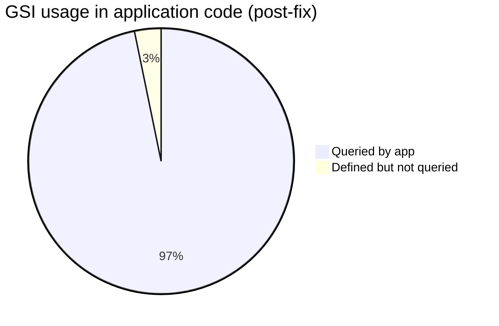

# Indexes Reference

Global Secondary Indexes (GSI) and Local Secondary Indexes (LSI) across all DynamoDB tables.

**Projection:** All GSIs in this codebase use `ProjectionType: ALL` unless noted.

**Last updated:** 2026-06-18 — list endpoints wired to GSIs via `Backend/utils/dynamoList.js`.

**See also:** [ACCESS_PATTERNS.md](./ACCESS_PATTERNS.md) · [TABLE_REFERENCE.md](./TABLE_REFERENCE.md)

---

## LSI summary

**None.** No table defines a Local Secondary Index.

---

## GSI usage overview

| Status | Count | Meaning |
|---|---|---|
| **Active** | ~30 index usages | Referenced in `QueryCommand` with `IndexName` (lookups + `list*` + FCM harvest) |
| **Inactive** | 1 | `WellnessCoach.SpecializationIdIndex` — defined; admin coach list filters `specializationId` via `FilterExpression` on status Query |
| **Removed from DDL** | 1 | `Admin.PhoneIndex` — removed from `createAdminTable.js` (was never queried) |

---

## Active indexes (queried in code)

### Lookup indexes

| Table | Index | PK | SK | Used by |
|---|---|---|---|---|
| `User` | `EmailIndex` | `email` | — | `getUserByEmail` |
| `User` | `PhoneKeyIndex` | `phoneKey` | — | `getUserByPhone` |
| `Admin` | `EmailIndex` | `email` | — | `getAdminByEmail` |
| `WellnessCoach` | `EmailIndex` | `email` | — | `getWellnessCoachByEmail` |
| `WellnessCoach` | `PhoneKeyIndex` | `phoneKey` | — | `getWellnessCoachByPhone` |
| `AssistantWellnessCoach` | `EmailIndex` | `email` | — | `getAssistantByEmail` |
| `AssistantWellnessCoach` | `PhoneKeyIndex` | `phoneKey` | — | `getAssistantByPhone` |
| `AssistantWellnessCoach` | `WellnessCoachIndex` | `wellnessCoachId` | `createdAt` | `listAssistantsByWellnessCoachId` |
| `StaticPage` | `SlugIndex` | `slug` | — | `getPageBySlug` |
| `Coupon` | `CouponCodeIndex` | `couponCode` | — | `getCouponByCode` |
| `Specialization` | `TitleKeyIndex` | `titleKey` | — | `getSpecializationByTitleKey` |

### List / filter indexes (via `dynamoList.js`)

| Table | Index | PK | SK | Used by |
|---|---|---|---|---|
| `User` | `StatusCreatedAtIndex` | `status` | `createdAt` | `listUsers`, FCM harvest |
| `WellnessCoach` | `StatusCreatedAtIndex` | `status` | `createdAt` | `listWellnessCoaches`, `countAllWellnessCoaches`, FCM harvest |
| `AssistantWellnessCoach` | `StatusCreatedAtIndex` | `status` | `createdAt` | `listAssistantWellnessCoaches`, FCM harvest |
| `Faq` | `StatusIndex` | `status` | `createdAt` | `listFaqs` |
| `Coupon` | `StatusIndex` | `status` | `createdAt` | `listCoupons` |
| `Notification` | `StatusSentAtIndex` | `status` | `sentAt` | `listNotifications` (status filter) |
| `Notification` | `AudienceSentAtIndex` | `audienceType` | `sentAt` | `listNotifications` (audience filter) |
| `StaticPage` | `StatusUpdatedAtIndex` | `status` | `updatedAt` | `listPages` |
| `Transformation` | `StatusCreatedAtIndex` | `status` | `createdAt` | `listTransformations` |
| `Transformation` | `UserIdCreatedAtIndex` | `userId` | `createdAt` | `listTransformations` (`userId` param) |
| `Banner` | `StatusCreatedAtIndex` | `status` | `createdAt` | `listBanners` |
| `CelebrationBanners` | `TypeCreatedAtIndex` | `type` | `createdAt` | `listCelebrationBanners` (`type` param) |
| `CelebrationBanners` | `StatusCreatedAtIndex` | `status` | `createdAt` | `listCelebrationBanners` (status filter) |
| `ClientTestimonials` | `StatusCreatedAtIndex` | `status` | `createdAt` | `listClientTestimonials` |
| `VideoTestimonials` | `StatusCreatedAtIndex` | `status` | `createdAt` | `listVideoTestimonials` |
| `HealthConcern` | `StatusCreatedAtIndex` | `status` | `createdAt` | `listHealthConcerns` |
| `HealthDisorder` | `StatusCreatedAtIndex` | `status` | `createdAt` | `listHealthDisorders` |
| `HealthTool` | `StatusCreatedAtIndex` | `status` | `createdAt` | `listHealthTools` |
| `HealthRecipe` | `StatusCreatedAtIndex` | `status` | `createdAt` | `listHealthRecipes` |
| `HealthRecipe` | `HealthConcernCreatedAtIndex` | `healthConcernId` | `createdAt` | `listHealthRecipes` (`healthConcernId` param) |
| `Yoga` | `StatusCreatedAtIndex` | `status` | `createdAt` | `listYoga` |
| `Specialization` | `StatusCreatedAtIndex` | `status` | `createdAt` | `listSpecializations` |

### Base-table access

| Table | Pattern | Keys |
|---|---|---|
| `Admin` | `getAdminById` / CRUD | `GetItem` on PK `id`; legacy composite rows resolved via fallback Query |

---

## Inactive indexes

| Table | Index | PK | SK | Notes |
|---|---|---|---|---|
| `WellnessCoach` | `SpecializationIdIndex` | `specializationId` | `createdAt` | Optional future optimization for coach-by-specialization admin filter |

---

## Index design conventions

| Convention | Example |
|---|---|
| Status listing | `{ status HASH, createdAt RANGE }` named `StatusCreatedAtIndex` (Faq/Coupon use legacy name `StatusIndex`) |
| Unique lookup | Single-hash GSI: `EmailIndex`, `PhoneKeyIndex`, `SlugIndex`, `CouponCodeIndex`, `TitleKeyIndex` |
| Parent-child | `WellnessCoachIndex`: `wellnessCoachId` + `createdAt` on assistants |
| Phone normalization | `phoneKey` = `{countryCode}#{phone}` for stable GSI key |

---

## Pagination implementation

All `list*` functions use `Backend/utils/dynamoList.js`:

- **Query** on the appropriate GSI partition when `status`, `type`, `healthConcernId`, `userId`, or `audienceType` is provided (or merges `active`/`inactive` partitions when omitted).
- **`ExclusiveStartKey`** iteration with skip/limit — avoids loading the full table before slicing.
- **`FilterExpression`** for text `contains` search only (not indexable).

---

## Deployment notes

| Change | Action required on existing AWS tables |
|---|---|
| `Admin` single-key PK | `node migration/migrateAll.js` from `Backend/` (see `migration/README.md`) |
| `ClientTestimonials` / `VideoTestimonials` GSI | Same — migration `02-testimonials-status-gsi` |
| `Admin.PhoneIndex` removal | Migration `03-admin-drop-phone-index` (no-op if table recreated via `01`) |
| Media attribute camelCase | Migration `04-media-field-camelcase` — `profileImage`, `videoSpecification` |
