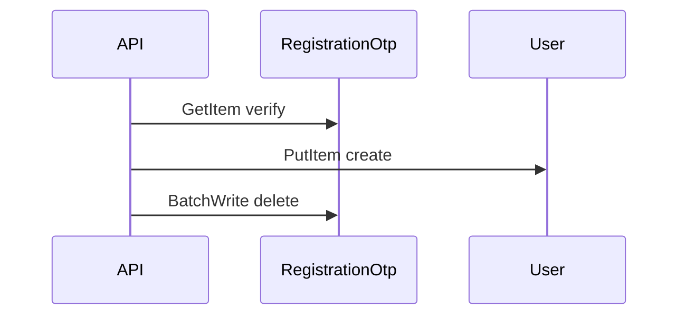

# DynamoDB Operations

Conditional writes, batch operations, transactions, and retry behavior as implemented in this codebase.

**See also:** [ACCESS_PATTERNS.md](./ACCESS_PATTERNS.md) · `Backend/config/db.js`

---

## Client configuration

| Setting | Value | Source |
|---|---|---|
| SDK | AWS SDK v3 | `@aws-sdk/client-dynamodb`, `@aws-sdk/lib-dynamodb` |
| Document client | `DynamoDBDocumentClient.from(client)` | `Backend/config/db.js` |
| `removeUndefinedValues` | `true` | Omits undefined attributes on write |
| `convertEmptyValues` | `false` | Empty strings are not converted to null |
| Region | `AWS_REGION` (default `ap-south-1`) | `Backend/config/index.js` |
| Credentials | `AWS_ACCESS_KEY_ID` + `AWS_SECRET_ACCESS_KEY` | Optional if `DYNAMODB_SKIP_VERIFY=true` |

---

## Operation matrix by entity

| Operation | Tables using it |
|---|---|
| **PutItem** | All tables (create) |
| **GetItem** | All tables except batch-only OTP delete path |
| **UpdateItem** | All tables except `RegistrationOtp` |
| **DeleteItem** | All entity tables |
| **Query** | User, Admin, WellnessCoach, AssistantWellnessCoach, StaticPage, Coupon, Specialization |
| **Scan** | User, WellnessCoach, AssistantWellnessCoach, all content `list*` functions, FCM audience |
| **BatchWriteItem** | `RegistrationOtp` only |
| **TransactWriteItem** | **None** |

---

## Conditional expressions

### Create (idempotency / duplicate prevention)

```
ConditionExpression: attribute_not_exists(id)
```

Used on `PutItem` in every `create*` function across models.

**Exceptions:**

| Table | Key condition |
|---|---|
| `RegistrationOtp` | No condition on Put (overwrites same `lookupKey`) |
| `AppConfig` | `attribute_not_exists(id)` on singleton create |

### Update (existence check)

```
ConditionExpression: attribute_exists(id)
```

Standard for all content and identity updates.

**Admin-specific:**

```
ConditionExpression: attribute_exists(id) AND attribute_exists(createdAt)
```

Required because `Admin` uses composite primary key (`id` + `createdAt`).

### Delete (existence check)

Same as update: `attribute_exists(id)` (plus `createdAt` for Admin).

### No optimistic locking

No `version` attribute or `attribute_equals` conditions for concurrent update control.

---

## Batch operations

### `RegistrationOtp` — BatchWrite delete

`registrationOtpModel.deleteRegistrationOtp`:

1. Resolves 1–2 `lookupKey` values (email and/or phone)
2. Builds `DeleteRequest` per key
3. Single `BatchWriteCommand` with up to 2 items

**Gaps:**

- No retry loop for `UnprocessedItems`
- Batch size always ≤ 2 (within DynamoDB 25-item limit)

### BatchGetItem

**Not used** in application code.

### BatchWrite Put

**Not used** (only BatchWrite Delete for OTP).

---

## Transactions

`TransactWriteCommand` / `TransactGetCommand` — **not used**.

Cross-table operations (e.g. register user + delete OTP) are **not atomic**:



Failure between steps can leave inconsistent state (user created, OTP not cleared, etc.).

---

## Retry & backoff

### Application layer

**No custom retry**, backoff, or circuit breaker wrappers around `docClient.send()`.

### AWS SDK default

`@aws-sdk/client-dynamodb` includes `@smithy/middleware-retry` with exponential backoff for:

- Throttling (`ProvisionedThroughputExceededException`, `ThrottlingException`)
- Transient service errors

Configurable via SDK client options — **not customized** in `Backend/config/db.js`.

### Idempotency

- Create operations rely on `attribute_not_exists(id)` — retry of successful create fails safely
- Updates/deletes without idempotency tokens — retry may be safe but not explicitly designed

---

## Pagination patterns

### DynamoDB native pagination

Scan loops use `ExclusiveStartKey` / `LastEvaluatedKey` until exhaustion:

```javascript
do {
  const { Items, LastEvaluatedKey } = await docClient.send(new ScanCommand({ ... }));
  rows.push(...Items);
  lastKey = LastEvaluatedKey;
} while (lastKey);
```

### Application pagination

After **full table scan**, results are:

1. Sorted in memory (`createdAt` or `sentAt` descending)
2. Sliced by `page` and `limit`

This is **not** DynamoDB cursor-based API pagination — every list request re-scans (or re-queries) the full dataset.

---

## Error handling

Models throw generic `Error` or named errors:

| Error | When |
|---|---|
| `NotFoundError` | Update/delete when record missing |
| `DUPLICATE_SLUG` | StaticPage slug collision |
| `DUPLICATE_COUPON_CODE` | Coupon code exists |
| `DUPLICATE_TITLE` | Specialization title exists |

`ConditionalCheckFailedException` from DynamoDB is **not explicitly caught** in models — propagates to Express error handler.

---

## Migration script (inactive)

`Backend/script/migrate.js` is fully commented out. When enabled, it would:

- `Scan` source table in pages
- `BatchWriteItem` Put to target region
- Retry unprocessed items in a loop (commented reference implementation)

Not active in production workflow.

---

## Operational checklist

| Item | In code? |
|---|---|
| Conditional creates | ✓ |
| Conditional updates/deletes | ✓ |
| TransactWrite | ✗ |
| BatchGet | ✗ |
| BatchWrite with retry | Partial (OTP delete, no retry) |
| Custom SDK retry config | ✗ |
| DynamoDB Streams consumers | ✗ |
| PITR / backups | Not specified |
