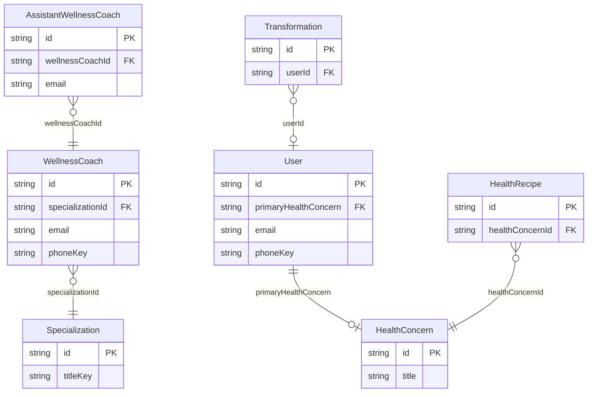
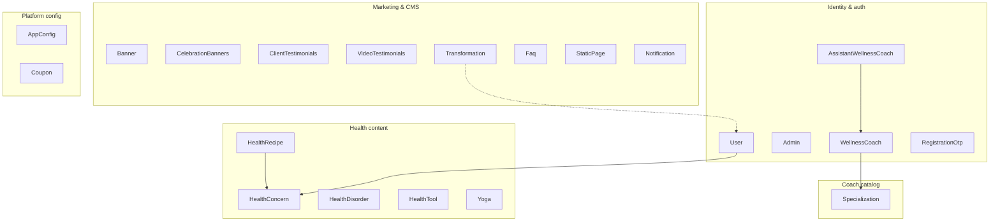
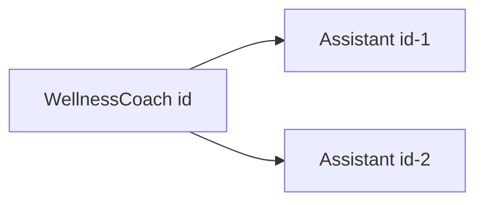
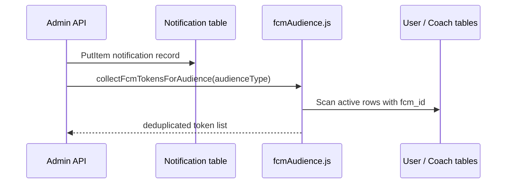

# Entity Relationships

How domain entities relate to each other in DynamoDB. This application uses **multi-table design** with **string foreign-key attributes** — there are no joins, foreign-key constraints, or referential-integrity transactions at the database layer.

**See also:** [TABLE_REFERENCE.md](./TABLE_REFERENCE.md) · [ACCESS_PATTERNS.md](./ACCESS_PATTERNS.md) · [DATABASE_ARCHITECTURE.md](../../DATABASE_ARCHITECTURE.md)

---

## Relationship modeling patterns used

| Pattern | Where used | Description |
|---|---|---|
| **Foreign-key attribute** | Coach → Specialization, Assistant → Coach, Recipe → Concern, User → Concern, Transformation → User | Parent `id` stored as string on child or referencing record |
| **Application-level join** | Assistant API responses | `populateWellnessCoach()` / `populateWellnessCoaches()` issue separate `GetItem` calls |
| **GSI parent-child query** | Assistant → Coach | `WellnessCoachIndex` on `AssistantWellnessCoach` enables efficient list/count by `wellnessCoachId` |
| **Singleton record** | `AppConfig` | Fixed PK `id = "app-config"` — not related to other tables |
| **Ephemeral lookup table** | `RegistrationOtp` | Keyed by `lookupKey` (`email:…` / `phone:…`); no FK to `User` until registration completes |
| **Denormalization** | Minimal | Coach name/title are **not** copied onto assistant items; built at read time |

**Not used:** adjacency lists, item collections, many-to-many junction tables, DynamoDB transactions for cross-table consistency.

---

## Core relationship diagram

---

## Domain grouping diagram

Logical groupings — **not** co-located in a single DynamoDB table.

---

## Relationship catalog

### 1. User → HealthConcern

| Property | Value |
|---|---|
| **Type** | Many-to-one (optional) |
| **FK field** | `User.primaryHealthConcern` → `HealthConcern.id` |
| **Enforcement** | Application validates via `getHealthConcernById()` on register/update (`authController`, `userProfileHelpers`, `adminController/userController`) |
| **On delete concern** | Not specified in code — orphaned ids possible |
| **Cardinality** | Each user has at most one primary concern; each concern can be referenced by many users |

---

### 2. WellnessCoach → Specialization

| Property | Value |
|---|---|
| **Type** | Many-to-one (optional) |
| **FK field** | `WellnessCoach.specializationId` → `Specialization.id` |
| **Enforcement** | `getSpecializationById()` on coach register/create (`wellnessCoachController/authController`, `adminController/wellnessCoachController`) |
| **GSI** | `SpecializationIdIndex` on `WellnessCoach` exists but is **not queried** in application code |
| **Cardinality** | Many coaches per specialization |

---

### 3. AssistantWellnessCoach → WellnessCoach

| Property | Value |
|---|---|
| **Type** | Many-to-one (required) |
| **FK field** | `AssistantWellnessCoach.wellnessCoachId` → `WellnessCoach.id` |
| **Enforcement** | Required on create (`buildAssistantItem`); coach existence checked in controllers via `getWellnessCoachById()` |
| **GSI** | `WellnessCoachIndex` (PK `wellnessCoachId`, SK `createdAt`) — used for list and count |
| **Read pattern** | `populateWellnessCoach()` fetches coach + specialization title for API embedding |
| **Cardinality** | One coach, many assistants |

---

### 4. HealthRecipe → HealthConcern

| Property | Value |
|---|---|
| **Type** | Many-to-one |
| **FK field** | `HealthRecipe.healthConcernId` → `HealthConcern.id` |
| **Enforcement** | Not specified in code — needs confirmation whether create validates concern exists |
| **GSI** | `HealthConcernCreatedAtIndex` defined but listing filters via **Scan**, not Query |
| **Cardinality** | Many recipes per concern |

---

### 5. Transformation → User

| Property | Value |
|---|---|
| **Type** | Many-to-one (optional) |
| **FK field** | `Transformation.userId` → `User.id` (optional attribute) |
| **Enforcement** | None in model layer |
| **GSI** | `UserIdCreatedAtIndex` defined but **not used** — `listTransformations({ userId })` uses Scan |
| **Cardinality** | A user may have zero or many transformation stories |

---

## Entities with no cross-table relationships

These tables are **standalone** in the codebase — no FK attributes pointing to or from other tables:

| Table | Notes |
|---|---|
| `Admin` | Independent auth domain |
| `RegistrationOtp` | Pre-registration; keyed by email/phone lookup, not user id |
| `AppConfig` | Singleton configuration |
| `Faq` | Content |
| `Coupon` | Commerce |
| `Notification` | References audience type string (`users` / `coaches`), not user ids |
| `StaticPage` | CMS |
| `Banner` | Marketing |
| `CelebrationBanners` | Marketing |
| `ClientTestimonials` | Marketing |
| `VideoTestimonials` | Marketing |
| `HealthDisorder` | Catalog (no link to HealthConcern in schema) |
| `HealthTool` | Catalog |
| `Yoga` | Content |

---

## Notification → audience (logical, not relational)

`Notification.audienceType` is either `users` or `coaches`. Sending a notification does **not** store recipient ids on the notification item. Instead, `fcmAudience.js` scans:

- `users` → `User` table
- `coaches` → `WellnessCoach` + `AssistantWellnessCoach` tables

This is a **runtime fan-out**, not a stored many-to-many relationship.

---

## Cascade and orphan behavior

| Scenario | Behavior in code |
|---|---|
| Delete `WellnessCoach` | Assistants **not** auto-deleted — orphans possible |
| Delete `Specialization` | Coaches with `specializationId` **not** updated |
| Delete `HealthConcern` | Users/recipes referencing id **not** updated |
| Delete `User` | Transformations with `userId` **not** updated |

**Recommendation:** Document or implement cleanup jobs if hard deletes are introduced.

---

## Join emulation reference (code)

| Function | File | Reads |
|---|---|---|
| `populateWellnessCoach` | `assistantWellnessCoachModel.js` | `WellnessCoach` by id, then `Specialization` for title |
| `populateWellnessCoaches` | `assistantWellnessCoachModel.js` | Same, with per-request caches |
| `specializationTitleForCoach` | `assistantWellnessCoachModel.js` | `Specialization` by `coach.specializationId` |
| Health concern validation | `userController/*`, `adminController/userController` | `HealthConcern` by id |
| Specialization validation | `wellnessCoachController/*` | `Specialization` by id |

---

## Cardinality summary

| Parent | Child / Referrer | Cardinality | FK attribute |
|---|---|---|---|
| `HealthConcern` | `User` | 1 : N | `primaryHealthConcern` |
| `HealthConcern` | `HealthRecipe` | 1 : N | `healthConcernId` |
| `Specialization` | `WellnessCoach` | 1 : N | `specializationId` |
| `WellnessCoach` | `AssistantWellnessCoach` | 1 : N | `wellnessCoachId` |
| `User` | `Transformation` | 1 : N (optional) | `userId` |
